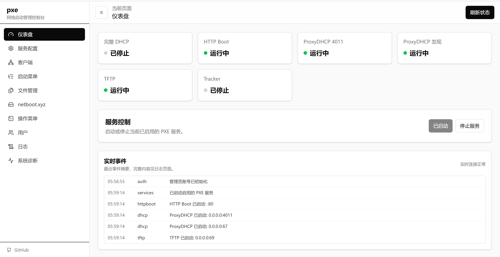
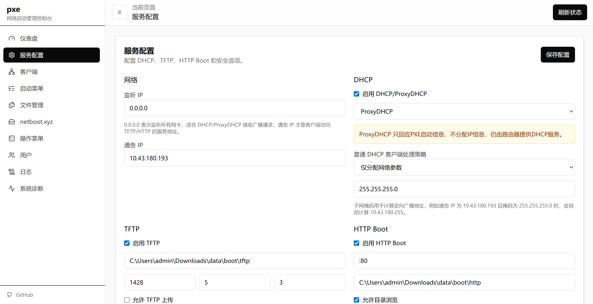
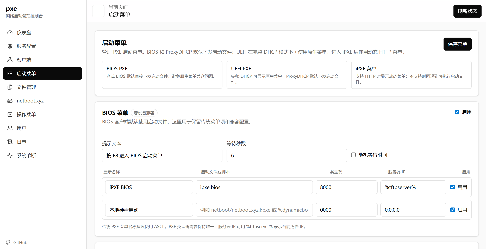
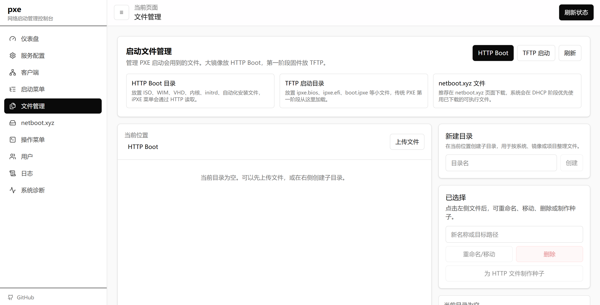
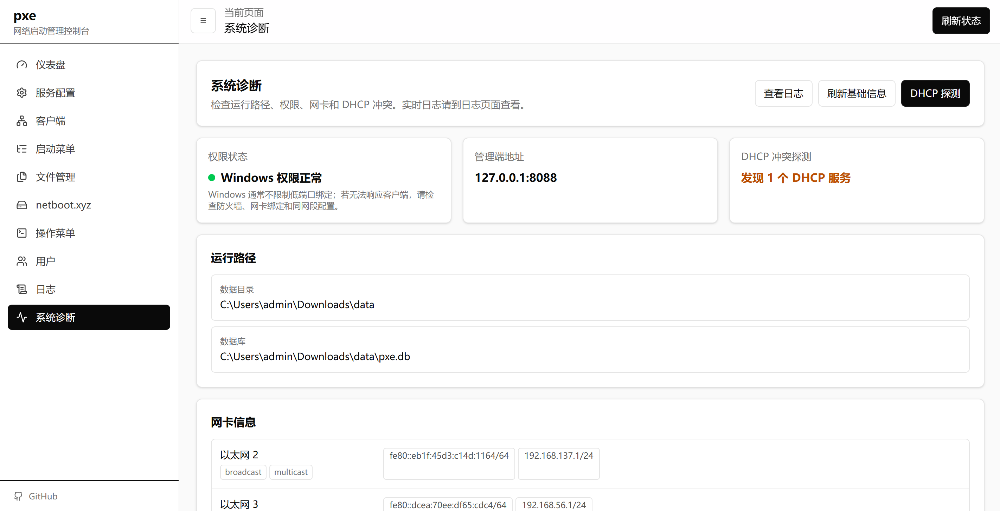

## PXE
> 基于 Go + Vue 3 构建的**跨平台** PXE 网络启动管理服务，轻松实现多系统环境下的开箱即用。

## ✨ 功能特点

* 🖥️ **全平台支持**：采用 Go 语言开发，原生跨平台（Windows / Linux / macOS），无需繁琐的环境配置。
* 📱 **Web 可视化管理**：纯中文响应式界面，完美适配手机与电脑，支持登录认证与实时日志查看。
* ⚙️ **服务一键管控**：在 Web 端即可启动、停止或重启 DHCP (含 ProxyDHCP)、TFTP、HTTP Boot、SMB 和 Torrent 服务。
* 📡 **智能网络引导**：
    * **完整 DHCP**：支持标准 DHCP 地址分配及 ProxyDHCP 模式（不影响现有路由）。
    * **自动适配**：智能识别终端架构（BIOS / UEFI / iPXE）并下发引导文件。
    * **内置 netboot.xyz**：支持官方源拉取，同时兼容自定义启动文件。
* ⚡ **高效协议传输**：提供稳定且带重试机制的 TFTP，以及支持缓存和虚拟路径的 HTTP Boot 服务。
* 🗂️ **在线文件管理**：内置文件浏览器，支持在线上传、多级目录管理。
* 💾 **轻量级存储**：底层使用纯 Go SQLite（默认 `data/pxe.db`），零外部数据库依赖。

## 运行

[Releases](https://github.com/sky22333/netboot/releases)页面下载构建好的二进制文件

win系统直接双击打开，linux系统需要使用命令行启动。

```
./pxe
```

不带参数启动时，程序会切换到可执行文件所在目录，并在当前目录自动创建`data`目录。常用参数（可选项）：

```text
--config     指定 pxe.toml
--data-dir   指定数据目录
--host       覆盖管理端监听主机
--port       覆盖管理端端口
--no-browser 禁止自动打开浏览器
```

启动成功后，会自动打开默认浏览器访问管理面板，终端环境没有浏览器的场景则不会打开。

## 运行时目录

```text
data/
├─ pxe.toml
├─ pxe.db
├─ secret.key
├─ logs/pxe.log
├─ boot/
│  ├─ netboot/  # netboot.xyz 下载文件
│  ├─ tftp/     # 自定义 TFTP 文件，可为空
│  └─ http/     # 自定义 HTTP Boot 文件，可为空
├─ smb/
└─ exports/
```

`boot/netboot` 会通过 TFTP 的 `netboot/...` 和 HTTP 的 `/netboot/...` 暴露出来，不需要复制到 `boot/tftp` 或 `boot/http`。完全离线时请把 netboot.xyz 启动文件放在 `boot/netboot`，把 ISO/WIM/VHD/内核等大文件放在 `boot/http`。

更多内容见 [docs](./docs)。

## 页面预览



---



---



---



---



---

## 💬 支持与反馈

如果您在使用过程中遇到问题或有任何建议，欢迎：
- 📧 提交 Issue
- 💡 提出功能建议
- 🔀 提交 Pull Request
